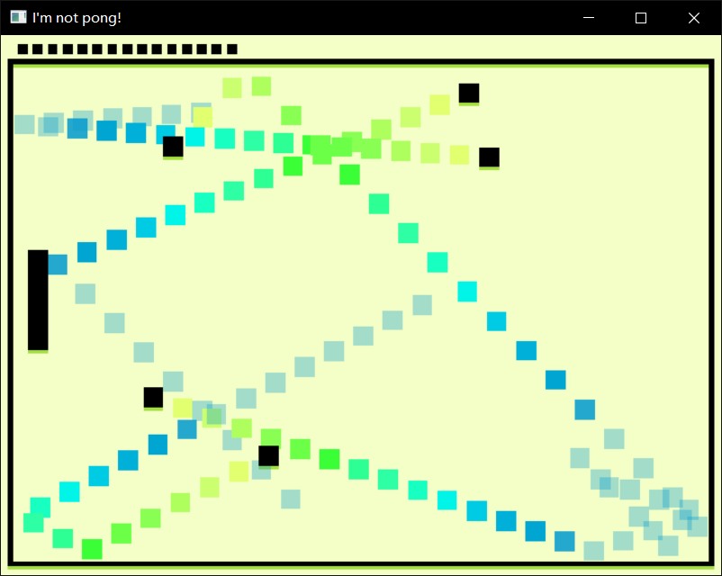

# (TODO: your game's title)

Author: Jiechen Li, jiechenl

Design: (TODO: In two sentences or fewer, describe what is new and interesting about your game.)

Compared with the prototype, this game remove the right paddle and add more balls. The target is to avoid balls, rather than hitting the balls.

Screen Shot:

How To Play:

Control the left paddle to avoid balls with your mouse.
When the left paddle hit balls, you will lose one point.
The less points you have, the faster balls' velocity is. The minimal of the points is zero, the maximal of the points is twenty.
You can use number "1 - 9" to control the number of balls.

This game was built with [NEST](NEST.md).
