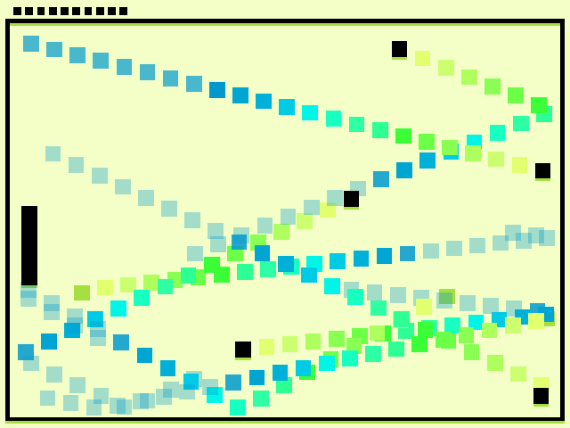

# I'm not pong!

Author: Jiechen Li, jiechenl

Design: 

Compared with the prototype, this game remove the right paddle and add more balls. The target is to avoid black balls and to hit green balls.

Screen Shot:

How To Play:

Control the left paddle to avoid black balls and to hit green balls with your mouse.
When the left paddle hit black balls, you will lose one point.
When the left paddle hit green balls, you will gain one point.
It's ok to touch the trails.
The less points you have, the faster balls' velocity is. The minimal of the points is zero, the default points is ten.
You can use number "1 - 9" to control the number of balls. If you think the game is too hard (default number is 10), you can press "1" to set the number of balls to 1.

This game was built with [NEST](NEST.md).
